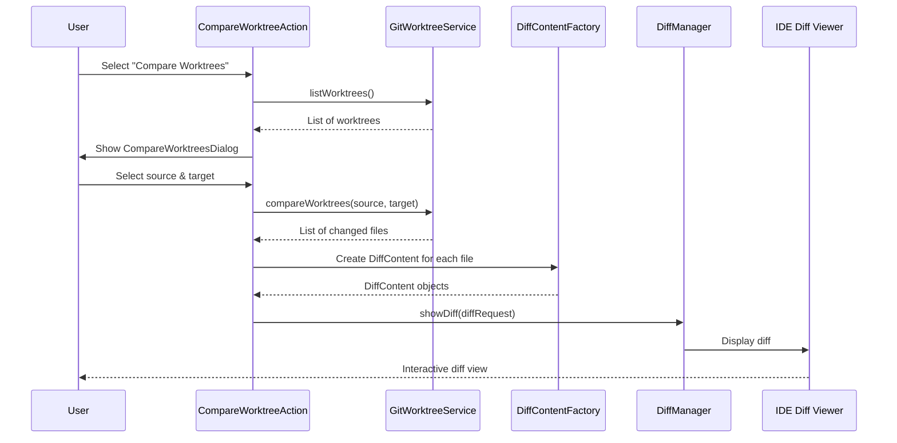
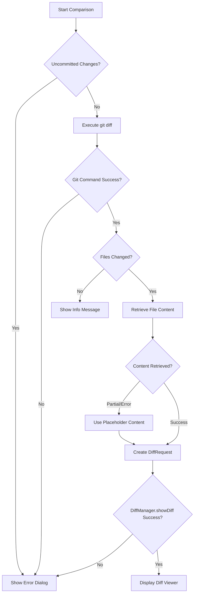

# Design Document

## Overview

This design replaces the current plain-text diff display (DiffResultDialog) with IntelliJ's native diff viewer infrastructure. The implementation will leverage the IntelliJ Platform's `DiffManager`, `DiffContent`, and `DiffRequest` APIs to provide a rich, interactive diff experience that matches the IDE's standard VCS diff functionality.

The key change is in the `CompareWorktreeAction` class, which currently displays raw Git diff output in a JTextArea. Instead, we'll construct DiffContent objects for each changed file and use DiffManager to show them in the IDE's diff viewer.

## Architecture

### High-Level Flow



### Component Changes

1. **GitWorktreeService.compareWorktrees()**
   - Modify to return structured data about changed files instead of raw diff text
   - Return a list of changed files with source/target paths and status (modified, added, deleted, renamed, copied)
   - Keep validation logic (uncommitted changes check) unchanged

2. **CompareWorktreeAction**
   - Remove DiffResultDialog class
   - Add logic to construct DiffRequest objects from comparison results
   - Use DiffManager.getInstance(project).showDiff() to display results
   - Handle background file content retrieval

3. **New: WorktreeDiffRequest**
   - Custom DiffRequest implementation for worktree comparisons
   - Holds source and target worktree information
   - Manages list of changed files
   - Provides title and window title for diff viewer

## Components and Interfaces

### Modified: GitWorktreeService

**New Return Type: WorktreeComparisonResult**

```kotlin
sealed class WorktreeComparisonResult {
    data class Success(
        val source: WorktreeInfo,
        val target: WorktreeInfo,
        val changedFiles: List<ChangedFile>
    ) : WorktreeComparisonResult()
    
    data class Failure(
        val error: String,
        val details: String? = null
    ) : WorktreeComparisonResult()
    
    data class NoChanges(
        val source: WorktreeInfo,
        val target: WorktreeInfo
    ) : WorktreeComparisonResult()
}

data class ChangedFile(
    val sourcePath: String?, // null when the file does not exist in the source worktree (e.g. added files)
    val targetPath: String?, // null when the file does not exist in the target worktree (e.g. deleted files)
    val status: FileStatus,
    val similarity: Int? = null // git rename/copy similarity score (0-100) when available
) {
    val displayPath: String
        get() = targetPath ?: sourcePath ?: "<unknown>"
}

enum class FileStatus {
    MODIFIED,
    ADDED,
    DELETED,
    RENAMED,
    COPIED
}
```

**Modified Method Signature:**

```kotlin
fun compareWorktrees(
    source: WorktreeInfo, 
    target: WorktreeInfo
): CompletableFuture<WorktreeComparisonResult>
```

**Implementation Changes:**
- Parse `git diff --name-status` output (including `R`/`C` entries) to get list of changed files with old/new paths
- Keep existing validation (uncommitted changes check)
- Return structured data instead of raw diff text
- Remove `git diff --stat` and full `git diff` commands (no longer needed)

### Modified: CompareWorktreeAction

**Key Changes:**

1. Remove `DiffResultDialog` inner class
2. Add method to create DiffRequest from comparison results
3. Use DiffManager to show diffs
4. Handle file content retrieval on background threads
5. Distinguish source/target sides when creating `DiffContent` so additions render empty on the source side and deletions retain their original content

**New Method:**

```kotlin
private fun showDiffViewer(
    project: Project,
    result: WorktreeComparisonResult.Success
) {
    val application = ApplicationManager.getApplication()
    
    application.executeOnPooledThread {
        try {
            val diffRequests = createDiffRequests(project, result)
            
            application.invokeLater({
                if (diffRequests.isEmpty()) {
                    Messages.showInfoMessage(
                        project,
                        "No differences found",
                        "Compare Worktrees"
                    )
                } else {
                    val chainRequest = SimpleDiffRequestChain(diffRequests)
                    DiffManager.getInstance().showDiff(project, chainRequest)
                }
            }, ModalityState.nonModal())
        } catch (e: Exception) {
            application.invokeLater({
                Messages.showErrorDialog(
                    project,
                    "Failed to open diff viewer: ${e.message}",
                    "Compare Worktrees"
                )
            }, ModalityState.nonModal())
        }
    }
}

private fun createDiffRequests(
    project: Project,
    result: WorktreeComparisonResult.Success
): List<DiffRequest> {
    val requests = mutableListOf<DiffRequest>()
    
    for (file in result.changedFiles) {
        val request = createDiffRequestForFile(project, result, file)
        if (request != null) {
            requests.add(request)
        }
    }
    
    return requests
}

private fun createDiffRequestForFile(
    project: Project,
    result: WorktreeComparisonResult.Success,
    file: ChangedFile
): DiffRequest? {
    val factory = DiffContentFactory.getInstance()
    
    val sourceContent = getFileContent(project, result.source, file, DiffSide.SOURCE, factory)
    val targetContent = getFileContent(project, result.target, file, DiffSide.TARGET, factory)
    
    val titlePath = file.displayPath
    val title = "${result.source.displayName} vs ${result.target.displayName}: $titlePath"
    
    return SimpleDiffRequest(
        title,
        sourceContent,
        targetContent,
        result.source.displayName,
        result.target.displayName
    )
}

private fun getFileContent(
    project: Project,
    worktree: WorktreeInfo,
    file: ChangedFile,
    side: DiffSide,
    factory: DiffContentFactory
): DiffContent {
    val relativePath = when (side) {
        DiffSide.SOURCE -> file.sourcePath
        DiffSide.TARGET -> file.targetPath
    } ?: return factory.createEmpty()

    val filePath = worktree.path.resolve(relativePath)
    if (filePath.exists()) {
        val virtualFile = LocalFileSystem.getInstance()
            .findFileByNioFile(filePath)
        return if (virtualFile != null) {
            factory.create(project, virtualFile)
        } else {
            factory.create("File not found: $relativePath")
        }
    }

    return factory.create("File not found: $relativePath")
}

private enum class DiffSide {
    SOURCE,
    TARGET
}
```

`DiffSide` ensures that added files render empty content on the source side while deleted files keep their original source content. The helper only falls back to empty content when the corresponding worktree truly lacks the file, preventing "file not found" placeholders for valid history.

## Data Models

### WorktreeComparisonResult

Sealed class hierarchy representing the outcome of a worktree comparison:

- **Success**: Contains source/target worktrees and list of changed files
- **Failure**: Contains error message and optional details
- **NoChanges**: Indicates no differences found

### ChangedFile

Represents a single file that differs between worktrees:

- `sourcePath`: Relative path in the source worktree (null for additions)
- `targetPath`: Relative path in the target worktree (null for deletions)
- `status`: FileStatus enum (captures add/delete/modify/rename/copy)
- `similarity`: Optional integer from Git rename/copy detection

### FileStatus

Enum representing the type of change:

- `MODIFIED`: File exists in both worktrees with different content
- `ADDED`: File exists only in the target worktree
- `DELETED`: File exists only in the source worktree
- `RENAMED`: File moved from `sourcePath` to `targetPath`
- `COPIED`: File copied to `targetPath` while keeping original at `sourcePath`

## Error Handling

### Error Scenarios

1. **Uncommitted Changes**
   - Detected during validation in GitWorktreeService
   - Return WorktreeComparisonResult.Failure with details
   - Display error dialog (existing behavior)

2. **Git Command Failure**
   - Catch exceptions during git diff execution
   - Return WorktreeComparisonResult.Failure
   - Display error dialog with Git error message

3. **File Content Retrieval Failure**
   - Handle missing files gracefully
   - Use DiffContentFactory.createEmpty() for missing files
   - Show placeholder content with error message

4. **Diff Viewer Opening Failure**
   - Catch exceptions when calling DiffManager.showDiff()
   - Display error dialog with exception message
   - Log error for debugging

### Error Flow



## Testing Strategy

### Unit Tests

1. **GitWorktreeService.compareWorktrees()**
   - Test parsing of `git diff --name-status` output
   - Test handling of modified, added, deleted, renamed, and copied files
   - Test error handling for Git command failures
   - Test validation of uncommitted changes

2. **CompareWorktreeAction**
   - Test creation of DiffRequest objects
   - Test handling of missing files
   - Test error scenarios (file not found, Git errors)

### Integration Tests

1. **End-to-End Comparison Flow**
   - Create two worktrees with known differences
   - Execute compare action
   - Verify DiffManager.showDiff() is called with correct parameters
   - Verify DiffRequest contains expected file paths

2. **File Content Retrieval**
   - Test retrieval of modified files
   - Test handling of added files (empty source)
   - Test handling of deleted files (empty target)
   - Test handling of renamed/copied files (source/target paths differ)

### Manual Testing

1. **UI Verification**
   - Verify diff viewer displays correctly
   - Verify syntax highlighting works
   - Verify navigation between files works
   - Verify keyboard shortcuts work

2. **Edge Cases**
   - Large number of changed files (performance)
   - Binary files
   - Very large files
   - Files with special characters in names

## Implementation Notes

### IntelliJ Platform APIs

**Key Classes:**

- `com.intellij.diff.DiffManager`: Main entry point for showing diffs
- `com.intellij.diff.DiffContentFactory`: Factory for creating DiffContent objects
- `com.intellij.diff.requests.SimpleDiffRequest`: Basic diff request implementation
- `com.intellij.diff.chains.SimpleDiffRequestChain`: Chain of diff requests for multiple files
- `com.intellij.diff.contents.DiffContent`: Represents content to be compared

**Usage Pattern:**

```kotlin
val factory = DiffContentFactory.getInstance()
val content1 = factory.create(project, virtualFile1)
val content2 = factory.create(project, virtualFile2)

val request = SimpleDiffRequest(
    "Title",
    content1,
    content2,
    "Left Label",
    "Right Label"
)

DiffManager.getInstance().showDiff(project, request)
```

### Threading Considerations

- File content retrieval must happen on background threads (not EDT)
- DiffManager.showDiff() must be called on EDT
- Use `ApplicationManager.getApplication().executeOnPooledThread()` for I/O
- Use `invokeLater()` to marshal results back to EDT

### Backward Compatibility

- Remove DiffResultDialog class (no longer needed)
- Keep CompareWorktreesDialog unchanged
- Keep validation logic in GitWorktreeService unchanged
- Update WorktreeOperationResult to support new return type (or create new result type)

## Migration Path

1. Add new data models (WorktreeComparisonResult, ChangedFile, FileStatus)
2. Modify GitWorktreeService.compareWorktrees() to return new result type
3. Update CompareWorktreeAction to use DiffManager
4. Remove DiffResultDialog class
5. Update tests to verify new behavior
6. Manual testing of diff viewer integration
